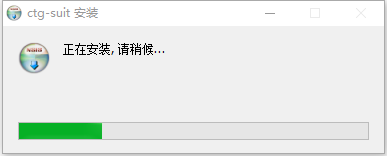
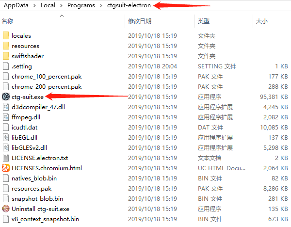

# 安装系统

胎监工作站需要在电脑上安装后再运行，安装程序名称为：ctg-suit Setup X.X.X.exe （X为数字）。
放在硬盘任何目录，双击exe后，会弹出安装进度框。



<br/>

无需任何配置，会自动安装到C盘，成功后自动打开平台。

程序会默认安装到到目录：

```
    C:\Users\用户名\AppData\Local\Programs\ctgsuit-electron\
```

<span style="background:yellow;">此目录下双击“ctg-suit.exe”也可打开平台，同时桌面也会生成快捷方式。</span>

