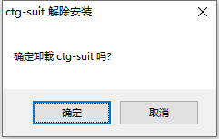
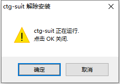

# 卸载系统

若需要清除电脑上的胎监工作站，请打开默认安装目录：

```
    C:\Users\用户名\AppData\Local\Programs\ctgsuit-electron\
```

双击运行 Uninstall ctg-suit.exe，会弹出提示框确认卸载。



<br/>

若选择【取消】，即放弃卸载。若选择【确定】，会判断工作站是否在运行中：



```
若工作站正在运行：会弹框提示是否关闭。若选【确定】则先关闭再卸载，若选【取消】即放弃卸载。
若工作站没有运行：会马上卸载整个平台。默认安装目录下所有文件将被清空。
```

<span style="background:yellow;">卸载本电脑运行的客户端，不会影响正在监控的设备。当下次重新安装，会自动读取被卸载期间的数据。</span>