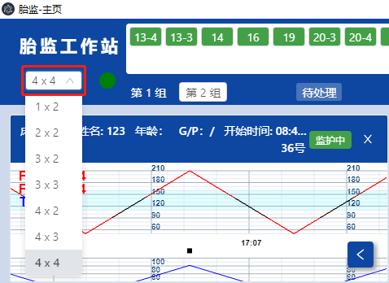

# 分组浏览

左上角的下拉框，能改变分组显示，支持以下排列方式：列（横向） ×  行（纵向）

```
    1×2   2×2   3×2   3×3   4×2   4×3   4×4
```

<span style="background:yellow;">例如：1×2是一列二行，4×3是四列三行。</span>



<br/>

单击列表下方的分组tab页，可以跳转到不同的组别显示。


<span style="background:yellow;">在其他系统菜单【孕妇管理】【档案管理】【系统设置】里点击上方分组tab页，同样可立即跳转到该分组显示。</span>
