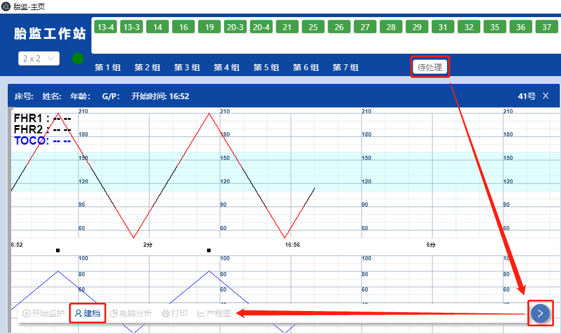

# 子机列表

胎监子机号和状态，数据源自于已用WiFi无线连接同一网段内的设备，顺序是根据上线先后的次序排列。

**在线状态**

凡是出现在子机列表内的床位图标，不管是正在监护还是停止监护，都属于在线状态。
当网络问题导致个别设备掉线时，子机列表不会标示出离线状态，图标将不会显示在子机列表内。

在所有分组的最右方，提供一个tab页：待处理。临时保存已记录监护但未建档的曲线，可到里面补充建档。

待处理tab页默认只保留24小时内的临时记录，超过此时限仍未补充建档的，会自动作出清除处理。