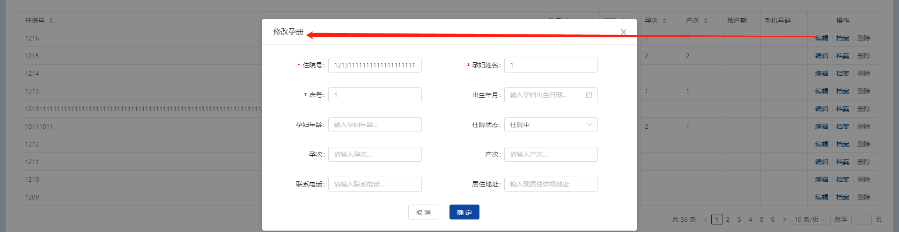
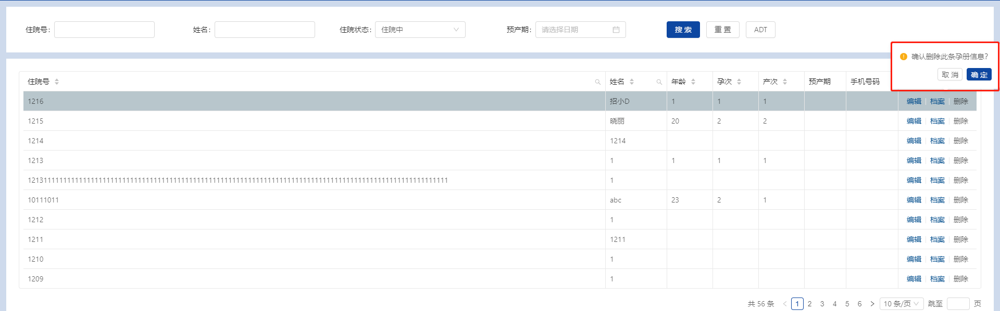
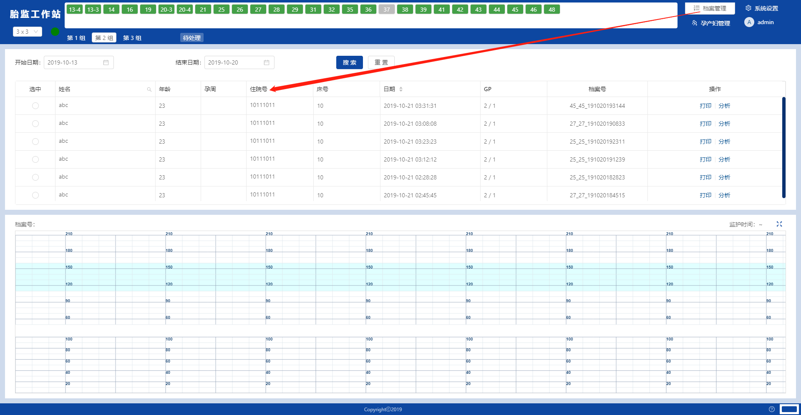

# 修改孕妇

下方表格显示已建档的孕妇列表，字段包含：住院号、姓名、年龄、孕次、产次、预产期、手机号，


<br/>

对应每一条记录，右方提供三种操作按钮：



```
编辑：会弹出编辑框，要输入的内容，和前文章节《建档页面》一致，请参考相关操作。
档案：单击会提供超链接，跳转到档案管理，根据该孕妇信息查出相关的监护档案记录。
删除：会弹框提示，确认则删除该孕妇资料。由于操作不可逆，请慎用。
```

