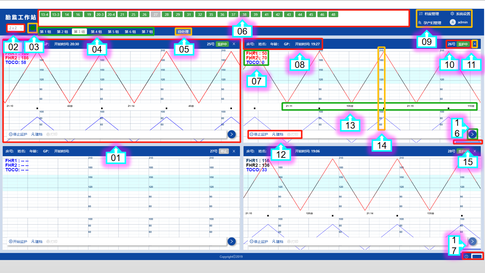

# 监护主页

监护主页是系统的首要功能，本页面分开多个功能区域：

```
    正上方：子机列表
    左上角：分组浏览、平台状态
    正中间：曲线面板
    右上角：系统入口
    右下角：颜色设置、帮助文档
```



```
01：曲线面板
02：分组浏览
03：平台状态
04：分组tab
05：待处理页
06：子机列表
07：瞬时数字
08：产妇信息
09：系统入口
10：床号状态
11：关闭展示
12：功能按钮
13：监护时间
14：数值坐标
15：滚动条
16：隐藏按钮
17：颜色帮助
```