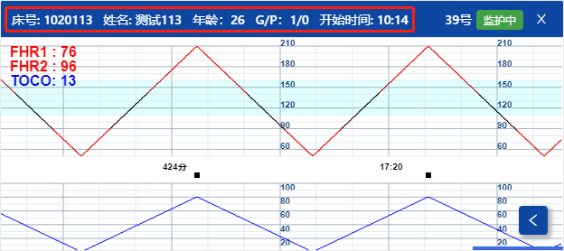
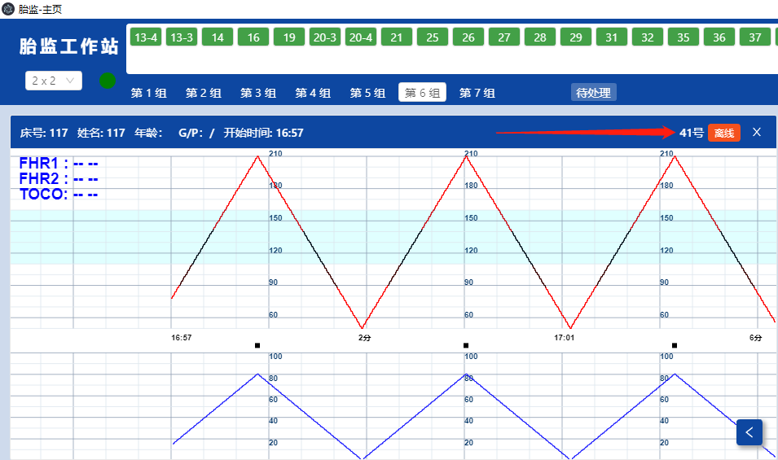
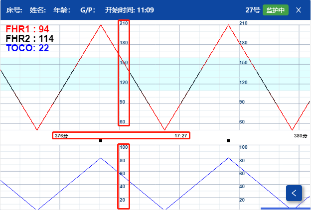
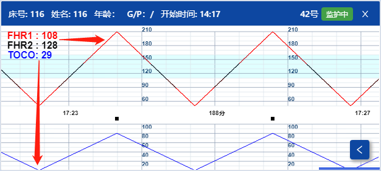

# 曲线面板

每一个床位的曲线面板，也分开多个功能显示的区域。

#### **孕妇信息**

曲线的上方，列出该孕妇建档时的资料。包含：床号、姓名、开始时间。


<br/>

#### **监护状态**

曲线图的右上方，同样显示本床的状态图标，监护状态的颜色，与子机列表的颜色标示一致，请参考相关描述。


<br/>

#### **在线状态**

当网络问题导致个别设备变成离线状态时，将在该曲线图的右上方，红色标出字眼“离线”。


<br/>

所以曲线面板的：监护状态+在线状态，共有三种颜色表示：

```
    灰色：停止监护
    绿色：正在监护
    红色：设备离线
```
<br/>

#### **CTG曲线**

每个床位至少显示两组曲线，横坐标为开始监控的时间。（相对时间+绝对时间）


而纵坐标分成：

```
    FHR：胎心率，单位是：bpm（次每分）。最小值50，最大值210。
    TOCO：宫缩压，单位是：%（百分比）。最小值0，最大值100。
```

<br/>

左上方提供曲线的瞬时取值，数字和曲线的颜色对应。


<span style="background:yellow;">若该孕妇为多胞胎，将会有2到3条FHR曲线，颜色也是对应的。</span>
