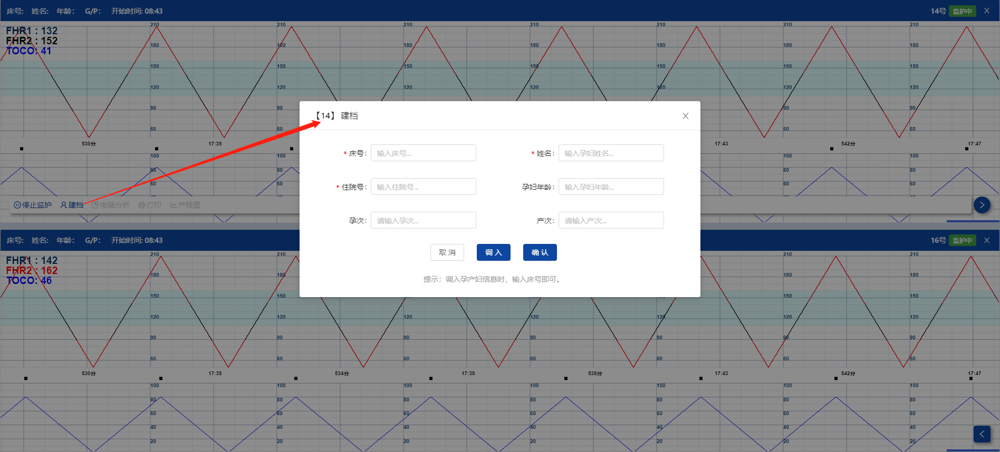

# 功能按钮

每一个床位的曲线面板，右下方都有一个【>】按钮，单击会变成【<】，同时弹出一组功能按钮。


<br/>

#### **开始监护**

设备正常情况下，系统只要检测到设备发出的无线信号，连续10秒后就会自动开始监护。

若设备没有自动启用监护，或已人为停止监护，则需要手动开启监护。

在停止监护的状态下，曲线处于空白停滞状态，单击【开始监护】不会弹出确认框，立即开始走纸记录。


<br/>

#### **停止监护**
在开始监护的状态下，曲线处于走动记录状态。

若该床号已建档，单击【停止监护】会弹出确认框，【确定】则停止走纸记录。


<br/>

若该床号未建档，单击【停止监护】将提示未建档，具体选择请参考后文章节《流程逻辑》。


<br/>

#### **孕妇建档**
在停止监护的状态下，【建档】为置灰不可用状态。在开始监护的状态下，单击【建档】将会弹出相关页面。


<br/>

#### **建档页面**

孕妇建档需要输入的字段有：

```
住院号（必填）：最大10位数字。
姓名（必填）：最大5位中文。
电话：最大11位数字。
年龄：最小值为1，最大2位数字。
孕次：最小值为1，最大值为10。
产次：最小值为0，最大值为10。
```


下方相关的功能按钮有：

```
取消：放弃孕妇建档，返回曲线面板。
调入：可根据输入的字段进行查询，下方给出结果列表以选择。
确定：输入完备后，确认建档。
```

支持【住院号】精确搜索，【姓名】模糊搜索。

<span style="background:yellow;">搜索调入的档案，不支持修改。若要变更资料，请到菜单【孕妇管理】操作。</span>

<br/>

#### **设备扫码**

系统有接口联通，当孕妇在医院挂号时，所登记的资料已登记到系统中。

使用设备扫描胎监的盒子，将会自动启用胎监设备，而无需人手启动监护。
使用设备扫描孕妇的手环，将会自动填入建档页面的所有字段，而无需人手在建档页面录入。

<span style="background:yellow;">系统支持扫描的机型有：PDA设备，安卓手机扫描程序apk。</span>

具体的流程逻辑，请参考后文章节《扫描操作》的描述。

<br/>

#### **打印曲线**

每一个床位的曲线面板，单击右下方【>】再按【打印】，将弹出打印功能页。


<br/>

```
左上方：孕妇资料区域，显示字段包含：住院号、姓名、年龄。
正下方：CTG曲线选定区域，下方滚动条支持左右拖动浏览。
正中间：PDF预览区域，能生成最终纸质打印的模拟效果。
右上角：时间设置区域，点击后弹出操作系统的打印设置框体，可进行最终的打印。
```


<br/>

先拖动左下方的灰色游标，选定一个开始时间，再到右上角按开始时间的【确定】。


再到右上角按结束时间的【选择】，然后到下方拖动灰色的游标，选定一个结束时间。


最后在右上角按【预览】，中间那会生成预览效果，回到右上角按【打印】。


之后将会弹出Windows系统打印机配置页，选择打印机进行打印。

<br/>

#### **全屏展示**

双击任何一张CTG曲线图，会放大到全屏观看，再次双击就返回分组显示。

<span style="background:yellow;">双击放大的鼠标操作，同样适用于上方子机列表的图标。</span>

<br/>

#### **拖动曲线**

在分组显示或全屏显示状态下，都可用拖动操作，来浏览过去的曲线形态。有两种方法，效果不同：


```
拖拽：在曲线中用鼠标向左拖动，将根据拖拽距离的像素，逐步向左移动浏览。
滚动：在曲线下方的滚动条向左拖动，将根据拖动距离占整体监护时间的百分比，瞬间跳到该时间点。
```

<span style="background:yellow;">若监护时间较长，滚动比拖拽的移动效率更大。</span>

松开鼠标约5秒钟后，曲线将自动跳回实时最新效果。

<br/>

#### **关闭展示**

任何一张CTG曲线图的右上角，都有一个【×】按钮。

该床位在监护停止状态下，弹框后【确定】将关闭该床位的CTG曲线图，同时也会停止监护。


<br/>

关闭后留下的单个空隙，将会由右方后续的床位的CTG曲线图移位补上。

若床位在未建档前提下，不能直接关闭该图。强行点击【×】按钮，等同于【停止监护】。会弹框提示是否补充建档，具体操作请参考后文章节《流程逻辑》。


<br/>

<span style="background:yellow;">当页面中央的某个CTG曲线图被关闭后，页面上方子机列表对应的床位图标，仍然保留在灰色的停止状态，不会被清除。</span>

若要重新打开，只要设备自动开始监护后，曲线图会自动再次显示在分组浏览中。
