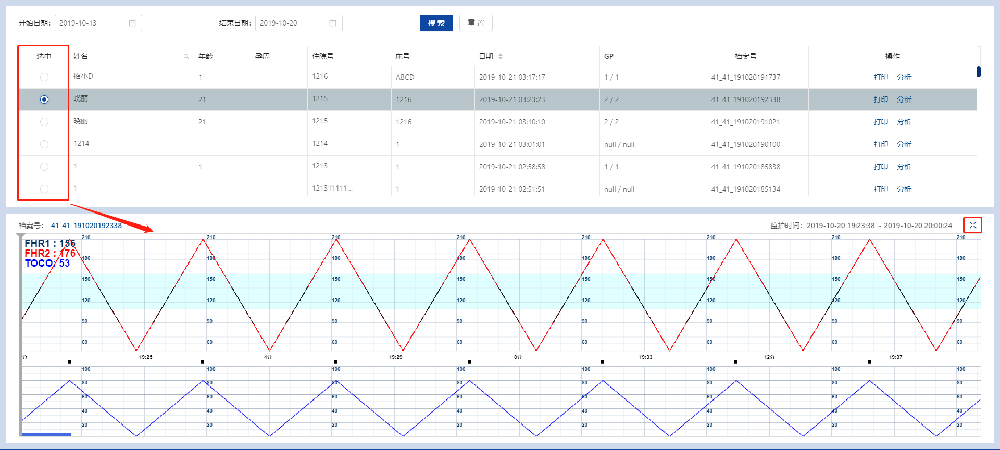
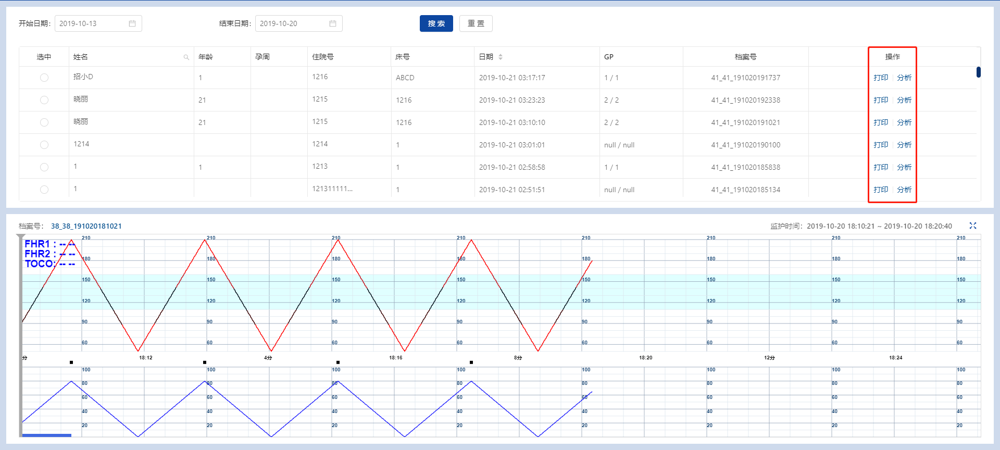

# 预览打印

页面中间表格的左方是单选按钮，选中单条记录后，面下方即可浏览该孕妇的CTG曲线。


下方显示的字段包含：档案号、开始监护时间、结束监护时间。

预览图的右上角有【×】按钮，单击后将最大化全屏显示，再次单击【×】将返回浏览表格。

<span style="background:yellow;">本功能页同样支持拖动浏览，具体操作和前文章节《拖动曲线》一致，请参考相关操作。</span>

<br/>

表格最右的操作字段，提供三种按钮：分析、打印、删除。


```
分析：同样提供分析功能入口，具体操作和前文章节《分析曲线》一致，请参考相关操作。
打印：同样提供打印功能入口，具体操作和前文章节《打印曲线》一致，请参考相关操作。
删除：会弹框提示，确认则删除此监护档案。由于操作不可逆，请慎用。
```
